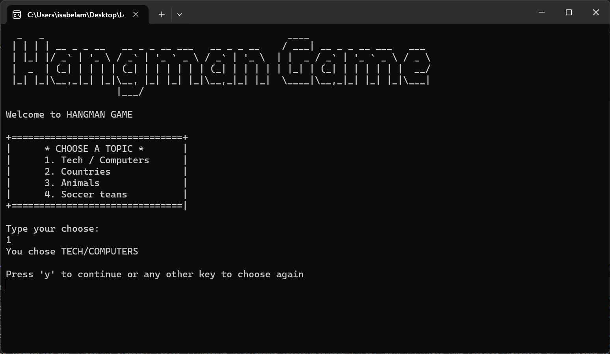

# C# Code Lab

Bem-vindo ao meu repositório C# Code Lab! 

Este repositório contém os principais projetos realizados durante minha jornada do DiverseDEV, programa de estágio do Mercado Eletrônico. Aqui você encontrará uma lista de projetos que realizei cuidadosamente enquanto estudava o vasto objeto do C#. 

Comecei este repositório em Novembro de 2023, no primeiro módulo do curso "C# Backend Developer" da Ada Tech, que contou com os módulos: Lógica de programação, Programação Orientada a Objetos, Técnicas de Programação, Programação Web e Testes Automatizados.

Espero que esses projetos possam guiar você em uma jornada de aprendizado, crescimento e transformação assim como me guiaram. 

## Tópicos disponíveis

- [Lógica de Programação](#logica-de-programação)

## Lógica de Programação

No módulo de lógica de programação, pude revisitar conceitos básicos (porém nunca desnecessários) como variáveis, interação com o console, aritmética computacional, estruturas condicionas, estruturas de repetição e arrays.  

### HangMan Game

Um singelo ConsoleApp que proporciona uma experiência divertida do clássico Jogo da Forca.

  
  

