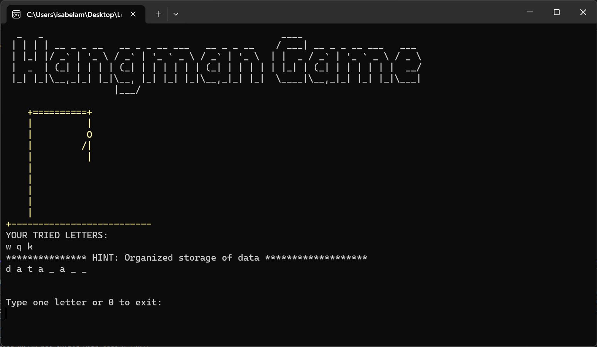
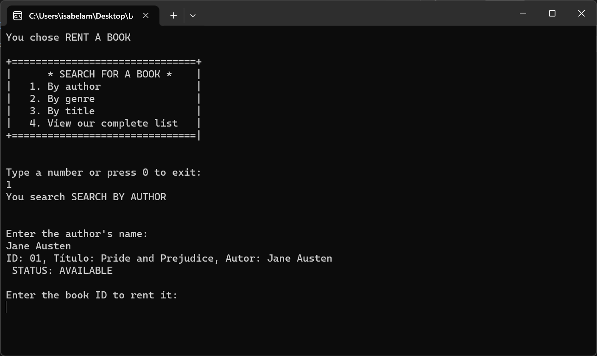
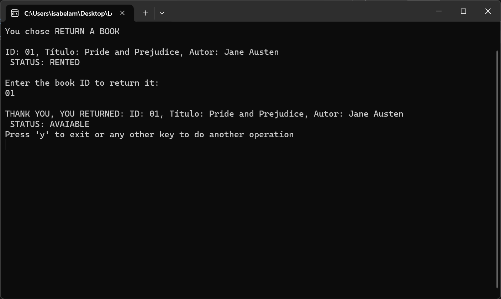

# C# Code Lab

Bem-vindo ao meu repositório C# Code Lab! 

Este repositório contém os principais projetos realizados durante minha jornada do DiverseDEV, programa de estágio do Mercado Eletrônico. Aqui você encontrará uma lista de projetos que realizei cuidadosamente enquanto estudava o vasto objeto do C#. 

Comecei este repositório em Novembro de 2023, no primeiro módulo do curso "C# Backend Developer" da Ada Tech, que contou com os módulos: Lógica de programação, Programação Orientada a Objetos, Técnicas de Programação, Programação Web e Testes Automatizados.

Espero que esses projetos possam guiar você em uma jornada de aprendizado, crescimento e transformação assim como me guiaram. 

## Tópicos disponíveis

- [Lógica de Programação](#logica-de-programação)

## Lógica de Programação

No módulo de lógica de programação, pude revisitar conceitos básicos (porém nunca desnecessários) como variáveis, interação com o console, aritmética computacional, estruturas condicionas, estruturas de repetição e arrays.  

### HangMan Game

Um singelo ConsoleApp que proporciona uma experiência divertida do clássico Jogo da Forca.

  
  

#### Funcionalidades
 `Menu Interativo:` Escolha uma categoria no menu para começar o jogo. As opções incluem Tecnologia/Computadores, Países, Animais e Times de Futebol.

`Diversidade de Palavras:` Cada categoria possui uma lista exclusiva de palavras para adivinhar, garantindo uma experiência variada a cada partida.

`Gráficos da Forca:` A interface exibe uma representação gráfica da forca conforme o jogador comete erros, tornando o jogo visualmente envolvente.

`Dicas e Palavra Oculta:` Receba dicas sobre a palavra a ser adivinhada e veja as letras adivinhadas até o momento.

`Replay:` Após o final do jogo, escolha jogar novamente ou encerrar o programa.

### Library System

Um singelo ConsoleApp que simula o sistema de uma biblioteca, é possível alugar e devolver livros. A biblioteca contém uma lista de livros de diferentes gêneros, como Romance, Ficção Científica, Mistério, Fantasia e Não Ficção.

  
  
   

#### Funcionalidades
`Menu Interativo:` Ao iniciar o programa, você é recebido com um menu interativo que oferece opções para alugar ou devolver um livro.

`Aluguel de Livros:` Escolha entre alugar um livro específico por autor, gênero, título ou explore a lista completa de livros disponíveis.

`Devolução de Livros:` Veja a lista de livros atualmente alugados e selecione o livro que deseja devolver.

`Pesquisa de Livros:` Realize pesquisas por autor, gênero ou título para encontrar livros que atendam aos seus interesses.

`Visualização da Lista Completa:` Explore a lista completa de livros disponíveis para aluguel.

